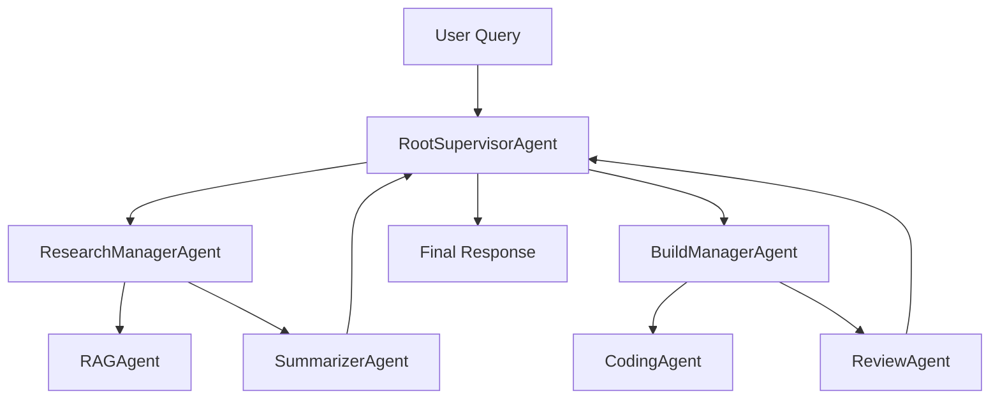

# Hierarchical Multi-Agent Orchestrator

A production-inspired, recruiter-friendly demonstration of hierarchical
multi-agent orchestration with **LLM-powered reasoning agents**. A
`RootSupervisorAgent` decomposes user queries, routes work to
specialized **manager agents**, and the managers delegate to focused
**worker agents**. Each agent reasons over its inputs, decides which
tools to call (and which to skip), and synthesizes its own response.
Every decision is captured on an observable execution timeline that the
Streamlit UI renders live, with full HITL (human-in-the-loop) support.

The project switches between two LLM modes automatically:

- **Real mode** (when `OPENAI_API_KEY` is set) — agents reason via
  OpenAI Chat Completions with structured JSON outputs.
- **Mock mode** (no API key) — agents still emit reasoning traces and
  invoke real deterministic tools, but synthesis is a clearly-labelled
  `[mock-llm]` placeholder. The UI shows a banner indicating the mode.

## Recruiter-friendly summary

- **3-layer hierarchical orchestration** — supervisor → managers →
  workers — modelled after real production systems.
- **LLM-powered reasoning agents**: every agent picks its own tools
  (function-calling style) and produces a trace the UI renders.
- **Structured Pydantic models** for every request, response, plan,
  state transition, and reasoning trace.
- **Intent-based routing**: BuildManager only fires on explicit code
  intent; reflective/philosophical text routes to SummarizerAgent only.
- **Local RAG over a small markdown knowledge base** with a hand-rolled
  retriever — no vector DB dependency.
- **Code generation + automated review** as a default quality gate,
  split across `code_review_tool`, `security_review_tool`, and
  `test_gap_tool`.
- **Streamlit UI** with reasoning panel, subtask table, state inspector,
  execution timeline, agent hierarchy visualization, and HITL controls.
- **Offline mock LLM** so the project demos cleanly without paid APIs.
- **Test suite** covering routing, agents, and orchestration flow.

## Architecture

```
RootSupervisorAgent
  ├── ResearchManagerAgent
  │      ├── RAGAgent
  │      └── SummarizerAgent
  │
  └── BuildManagerAgent
         ├── CodingAgent
         └── ReviewAgent
```



### Agent responsibilities

Every agent in the table is an **LLM-powered reasoning agent** built on
the `ReasoningAgent` base class — it reasons, picks tools, executes,
and synthesizes. The "Tools" column is the function-calling-style
toolset each agent's LLM can choose from.

| Layer | Agent                  | Responsibility                                                                | Tools                                                          |
|-------|------------------------|-------------------------------------------------------------------------------|----------------------------------------------------------------|
| 1     | `RootSupervisorAgent`  | LLM plans / routes to managers; aggregates final response.                    | `llm_planner`, `router_fallback`, `llm_aggregator`             |
| 2     | `ResearchManagerAgent` | LLM decides whether to call RAG, Summarizer, or both.                         | `call_rag_agent`, `call_summarizer_agent`                      |
| 2     | `BuildManagerAgent`    | LLM decides whether to call CodingAgent, ReviewAgent, or both. Review is the default quality gate. | `call_coding_agent`, `call_review_agent`                       |
| 3     | `RAGAgent`             | LLM picks `simple_retriever` and/or `load_knowledge_base`.                    | `simple_retriever`, `load_knowledge_base`                      |
| 3     | `SummarizerAgent`      | LLM synthesizes a 2-3 sentence summary directly (no external tools).          | _(none — pure synthesis)_                                      |
| 3     | `CodingAgent`          | LLM picks among template, code generation, and file context tools.            | `code_generation_tool`, `template_loader`, `file_context_tool` |
| 3     | `ReviewAgent`          | LLM picks among general, security, and test-coverage review tools.            | `code_review_tool`, `security_review_tool`, `test_gap_tool`    |

### Orchestration flow

1. The user submits a query through Streamlit (or the CLI).
2. `RootSupervisorAgent.plan()` calls the LLM to pick which managers
   should run. In mock mode it falls back to the deterministic
   intent-based `Router` (`src/orchestrator/router.py`), which also
   serves as the LLM's reference policy.
3. The supervisor builds an `ExecutionPlan` (a list of `AgentTask`s).
4. The `ExecutionEngine` runs each task sequentially, recording an
   `ExecutionStep` on the `OrchestratorState` for every transition and
   attaching the agent's full reasoning trace to the
   `subtask_complete` payload.
5. Each manager's LLM reasons over the request, picks which workers
   to call (e.g. ResearchManager may skip RAGAgent for pasted prose),
   and the workers in turn reason about their own tools.
6. The supervisor aggregates manager outputs into the user-facing
   answer via another LLM call.
7. Every event — supervisor plan, manager reasoning, worker reasoning,
   each tool invocation — is mirrored into the Streamlit "Execution
   Timeline", "Agent Reasoning Traces", and "Streaming Log" panels.

### Per-agent reasoning trace

Each agent emits an `AgentTrace` containing:

- `reasoning` — the LLM's chain-of-thought summary.
- `available_tools` — every tool the agent could have called.
- `selected_tools` — the tools it actually invoked, with rationale.
- `skipped_tools` — tools it considered but didn't need.
- `tool_invocations` — for each call: arguments, rationale, success,
  result preview.
- `final_response` — what the agent returned to its caller.

Example trace from the "meaning of life" demo query:

```
[ResearchManagerAgent] selected=[call_summarizer_agent] skipped=[call_rag_agent]
  reasoning: Long pasted text without lookup intent — summarizing directly.
  └─ [SummarizerAgent] selected=[] skipped=[]
       reasoning: No retrieved documents; will summarize the pasted text directly.
```

## Streamlit UI

> Screenshots — drop into `docs/screenshots/` and link them here once
> the app is running locally (e.g. ``).
> The UI ships with all of the panels described below.

The Streamlit app preserves every recruiter-visible orchestration
feature from the previous version:

- Conversation chat
- Manual / Auto / HITL execution modes
- **Reasoning & Decomposition** panel — shows the supervisor's plan,
  reasoning, planned tasks, and tools needed per task.
- **Subtask Results** panel — table of agent outcomes.
- **Agent Reasoning Traces** panel — per-agent expandable cards
  showing reasoning, selected vs. skipped tools, each tool
  invocation's rationale + result preview, and nested worker traces
  for manager agents.
- **LLM mode banner** — top-of-page indicator showing real vs. mock
  mode.
- **State Inspector (Debug)** — exposes `state_id`, `iteration_count`,
  every `ExecutionStep`, the `tool_path`, and the raw JSON output of the
  final orchestration result.
- **Streaming Log** — live orchestration trace pushed by the
  `StreamingCallbackHandler`.
- **Agent Hierarchy** sidebar — Graphviz-rendered tree of the 3-layer
  architecture.

### HITL (Human-In-The-Loop)

Three execution modes:

- **Auto** — runs end-to-end.
- **Manual** — runs to completion but explicitly through the supervisor's
  manual pipeline; useful for non-interactive contexts.
- **HITL** — pauses twice per run:
  1. **After decomposition** — the user reviews the planned subtasks and
     can Approve / Revise / Cancel.
  2. **Before each subtask** — the user confirms the upcoming agent
     invocation, with full visibility into what has completed so far.

The paused state is persisted to `.hitl_states/` so it survives
Streamlit reruns.

### State inspector and execution tracing

`OrchestratorState` is the single source of truth for everything that
happened during a run:

```
state_id          UUID for the run
user_query        The original request
plan              ExecutionPlan (reasoning + AgentTasks)
steps             Chronological list of ExecutionSteps
status            initialized / planning / running / paused / completed
current_tool      Currently executing agent
tool_path         Hierarchical path (e.g. RootSupervisorAgent.BuildManagerAgent)
final_answer      The aggregated user-facing answer
```

Step kinds emitted on the timeline:

- `task_decomposition` — supervisor produced a plan
- `subtask_started` — a manager began executing
- `subtask_complete` — a manager finished
- `orchestration_complete` — final answer aggregated

## Setup

### Prerequisites

- Python 3.10+

### Install

```bash
pip install -r requirements.txt
```

### Configuration (optional)

Create a `.env` file in the project root:

```env
OPENAI_API_KEY=sk-...        # optional — enables real LLM completions
OPENAI_MODEL=gpt-4.1-nano
LOG_LEVEL=INFO
```

Without `OPENAI_API_KEY`, the system runs entirely on the offline mock
LLM and deterministic worker fallbacks.

## Running locally

### Streamlit UI

```bash
streamlit run main.py
```

### CLI demo

```bash
python -m src.examples.demo_queries
```

The CLI prints the user query, routing decision, execution plan,
orchestration trace, and final response for each demo query.

### Tests

```bash
pytest
```

## Sample queries

1. *Summarize the architecture of this project.*
2. *Build a FastAPI endpoint for uploading documents and review the
   solution.*
3. *Search the knowledge base for agent orchestration patterns and
   generate implementation guidance.*
4. *Generate a simple Redis memory tool and review it for production
   concerns.*

Example orchestration trace (from query 3):

```
[RootSupervisor] Decomposing task
[ResearchManager] Requesting context retrieval
[RAGAgent] Retrieved architecture_notes.md, agent_patterns.md
[SummarizerAgent] Generated summary
[BuildManager] Starting implementation flow
[CodingAgent] Generated FastAPI endpoint
[ReviewAgent] Found missing error handling
[RootSupervisor] Aggregating final response
```

## Project structure

```
src/
  orchestrator/
    supervisor.py          # RootSupervisorAgent
    router.py              # Deterministic routing
    state.py               # Re-export of state models
    execution_engine.py    # Task loop + HITL hook
  agents/
    base.py
    research_manager.py
    build_manager.py
    rag_agent.py
    summarizer_agent.py
    coding_agent.py
    review_agent.py
  tools/
    document_loader.py        # loads knowledge_base/*.md
    simple_retriever.py       # token-overlap retriever
    code_generation_tool.py   # boilerplate skeletons
    template_loader.py        # named code templates
    file_context_tool.py      # find related project files
    code_review_tool.py       # general bugs/clarity review
    security_review_tool.py   # secrets + unsafe-call scan
    test_gap_tool.py          # missing-test detection
  models/
    requests.py            # AgentRequest
    responses.py           # AgentResponse, ReviewResult, ReviewFinding
    state_models.py        # OrchestratorState, ExecutionPlan, AgentTask, ExecutionStep
    trace.py               # AgentTrace, AgentReasoning, ToolDecision, ToolInvocation, ToolSpec, LLMMode
  llm/
    client.py              # OpenAI client with deterministic mock fallback
  examples/
    demo_queries.py        # CLI demo

knowledge_base/
  architecture_notes.md
  agent_patterns.md
  fastapi_examples.md

tests/
  test_routing.py
  test_agents.py
  test_orchestrator.py

ui/                        # Streamlit app
agent_defs/                # Legacy supervisor — now a thin bridge to src/
orchestration/             # AgentTree, HITLManager, StreamingCallbackHandler
models/                    # Legacy Pydantic models consumed by the Streamlit UI
main.py                    # `streamlit run main.py` entry point
```

## Backward compatibility

The previous version was a flat ReAct system built on the `openai-agents`
SDK with `SimpleAgent`, `MathAgent`, `EchoAgent`, and `ClassifierAgent`
worker agents. That layer has been removed; only the supervisor entry
point name is preserved:

- `agent_defs.supervisor.SupervisorAgent` is now a thin bridge that
  delegates every call to `src.orchestrator.RootSupervisorAgent` while
  exposing the same `orchestrate` / `orchestrate_manual` /
  `resume_orchestration` / `state` API the Streamlit app already
  consumes. Its `child_agents` dict reflects the live 3-layer hierarchy
  (managers + workers under `src/`).

## Future improvements

- Replace the keyword retriever with a sentence-transformer embedding
  store for richer retrieval.
- Add a `PlannerAgent` that uses the LLM to produce non-trivial multi-
  step plans (instead of the current 1-2 task plans).
- Add streaming token rendering in the Streamlit UI when an
  `ANTHROPIC_API_KEY` is configured.
- Persist `OrchestratorState` to disk and add a "rerun from step N"
  control to the state inspector.
