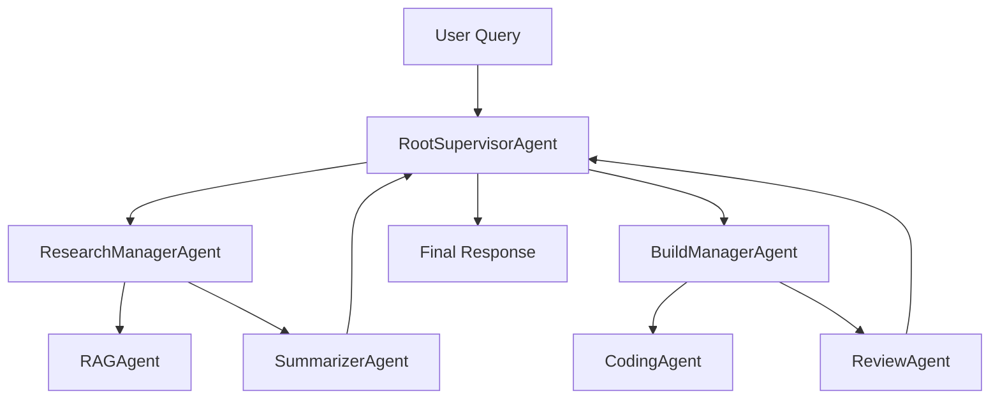

# Hierarchical Multi-Agent Orchestrator

A production-inspired, recruiter-friendly demonstration of hierarchical
multi-agent orchestration. A `RootSupervisorAgent` decomposes user
queries, routes work to specialized **manager agents**, and the managers
delegate the actual work to focused **worker agents**. Every step is
recorded on an observable execution timeline that the Streamlit UI
renders live, with full HITL (human-in-the-loop) support.

The project is intentionally **lightweight**: it runs offline (no API key
required), but transparently uses the OpenAI API when `OPENAI_API_KEY` is
set.

## Recruiter-friendly summary

- **3-layer hierarchical orchestration** — supervisor → managers →
  workers — modelled after real production systems.
- **Structured Pydantic models** for every request, response, plan, and
  state transition.
- **Deterministic routing** that is testable, reproducible, and easy to
  explain in an interview.
- **Local RAG over a small markdown knowledge base** with a hand-rolled
  retriever — no vector DB dependency.
- **Code generation + automated review** chain with a heuristic review
  tool (security, error handling, test coverage, clarity).
- **Streamlit UI** with reasoning panel, subtask table, state inspector,
  execution timeline, agent hierarchy visualization, and HITL controls.
- **Offline mock LLM** so the project demos cleanly without paid APIs.
- **Test suite** covering routing, agents, and orchestration flow.

## Architecture

```
RootSupervisorAgent
  ├── ResearchManagerAgent
  │      ├── RAGAgent
  │      └── SummarizerAgent
  │
  └── BuildManagerAgent
         ├── CodingAgent
         └── ReviewAgent
```



### Agent responsibilities

| Layer | Agent                  | Responsibility                                                                 |
|-------|------------------------|--------------------------------------------------------------------------------|
| 1     | `RootSupervisorAgent`  | Plan, route, aggregate; owns the orchestration state and timeline.             |
| 2     | `ResearchManagerAgent` | Coordinate the retrieval + summarization chain.                                |
| 2     | `BuildManagerAgent`    | Coordinate the code-generation + review chain.                                 |
| 3     | `RAGAgent`             | Retrieve relevant docs from the local markdown knowledge base.                 |
| 3     | `SummarizerAgent`      | Condense retrieved docs into a 2-3 sentence context summary.                   |
| 3     | `CodingAgent`          | Produce a focused Python/FastAPI snippet.                                      |
| 3     | `ReviewAgent`          | Audit generated code for bugs, security, missing tests, clarity, production.  |

### Orchestration flow

1. The user submits a query through Streamlit (or the CLI).
2. The supervisor's `Router` deterministically picks the needed managers
   based on keyword signals — research, build, or both.
3. The supervisor builds an `ExecutionPlan` (a list of `AgentTask`s).
4. The `ExecutionEngine` runs each task sequentially, recording an
   `ExecutionStep` on the `OrchestratorState` for every transition.
5. Each manager invokes its workers in order, passing structured context
   forward (retrieved documents become the CodingAgent's grounding).
6. The supervisor aggregates the final user-facing answer.
7. Every event is mirrored into the Streamlit "Execution Timeline" and
   "Streaming Log" panels.

## Streamlit UI

> Screenshots — drop into `docs/screenshots/` and link them here once
> the app is running locally (e.g. ``).
> The UI ships with all of the panels described below.

The Streamlit app preserves every recruiter-visible orchestration
feature from the previous version:

- Conversation chat
- Manual / Auto / HITL execution modes
- **Reasoning & Decomposition** panel — shows the routing reasoning,
  planned tasks, and tools needed.
- **Subtask Results** panel — table of agent outcomes.
- **State Inspector (Debug)** — exposes `state_id`, `iteration_count`,
  every `ExecutionStep`, the `tool_path`, and the raw JSON output of the
  final orchestration result.
- **Streaming Log** — live orchestration trace pushed by the
  `StreamingCallbackHandler`.
- **Agent Hierarchy** sidebar — Graphviz-rendered tree of the 3-layer
  architecture.

### HITL (Human-In-The-Loop)

Three execution modes:

- **Auto** — runs end-to-end.
- **Manual** — runs to completion but explicitly through the supervisor's
  manual pipeline; useful for non-interactive contexts.
- **HITL** — pauses twice per run:
  1. **After decomposition** — the user reviews the planned subtasks and
     can Approve / Revise / Cancel.
  2. **Before each subtask** — the user confirms the upcoming agent
     invocation, with full visibility into what has completed so far.

The paused state is persisted to `.hitl_states/` so it survives
Streamlit reruns.

### State inspector and execution tracing

`OrchestratorState` is the single source of truth for everything that
happened during a run:

```
state_id          UUID for the run
user_query        The original request
plan              ExecutionPlan (reasoning + AgentTasks)
steps             Chronological list of ExecutionSteps
status            initialized / planning / running / paused / completed
current_tool      Currently executing agent
tool_path         Hierarchical path (e.g. RootSupervisorAgent.BuildManagerAgent)
final_answer      The aggregated user-facing answer
```

Step kinds emitted on the timeline:

- `task_decomposition` — supervisor produced a plan
- `subtask_started` — a manager began executing
- `subtask_complete` — a manager finished
- `orchestration_complete` — final answer aggregated

## Setup

### Prerequisites

- Python 3.10+

### Install

```bash
pip install -r requirements.txt
```

### Configuration (optional)

Create a `.env` file in the project root:

```env
OPENAI_API_KEY=sk-...        # optional — enables real LLM completions
OPENAI_MODEL=gpt-4.1-nano
LOG_LEVEL=INFO
```

Without `OPENAI_API_KEY`, the system runs entirely on the offline mock
LLM and deterministic worker fallbacks.

## Running locally

### Streamlit UI

```bash
streamlit run main.py
```

### CLI demo

```bash
python -m src.examples.demo_queries
```

The CLI prints the user query, routing decision, execution plan,
orchestration trace, and final response for each demo query.

### Tests

```bash
pytest
```

## Sample queries

1. *Summarize the architecture of this project.*
2. *Build a FastAPI endpoint for uploading documents and review the
   solution.*
3. *Search the knowledge base for agent orchestration patterns and
   generate implementation guidance.*
4. *Generate a simple Redis memory tool and review it for production
   concerns.*

Example orchestration trace (from query 3):

```
[RootSupervisor] Decomposing task
[ResearchManager] Requesting context retrieval
[RAGAgent] Retrieved architecture_notes.md, agent_patterns.md
[SummarizerAgent] Generated summary
[BuildManager] Starting implementation flow
[CodingAgent] Generated FastAPI endpoint
[ReviewAgent] Found missing error handling
[RootSupervisor] Aggregating final response
```

## Project structure

```
src/
  orchestrator/
    supervisor.py          # RootSupervisorAgent
    router.py              # Deterministic routing
    state.py               # Re-export of state models
    execution_engine.py    # Task loop + HITL hook
  agents/
    base.py
    research_manager.py
    build_manager.py
    rag_agent.py
    summarizer_agent.py
    coding_agent.py
    review_agent.py
  tools/
    document_loader.py
    simple_retriever.py
    code_review_tool.py
  models/
    requests.py            # AgentRequest
    responses.py           # AgentResponse, ReviewResult, ReviewFinding
    state_models.py        # OrchestratorState, ExecutionPlan, AgentTask, ExecutionStep
  llm/
    client.py              # OpenAI client with deterministic mock fallback
  examples/
    demo_queries.py        # CLI demo

knowledge_base/
  architecture_notes.md
  agent_patterns.md
  fastapi_examples.md

tests/
  test_routing.py
  test_agents.py
  test_orchestrator.py

ui/                        # Streamlit app (legacy path preserved)
streamlit_app/             # Mirror namespace for future multi-page expansion
agent_defs/                # Legacy supervisor — now a thin bridge to src/
orchestration/             # AgentTree, HITLManager, StreamingCallbackHandler
models/                    # Legacy Pydantic models consumed by the Streamlit UI
main.py                    # `streamlit run main.py` entry point
```

## Backward compatibility

The previous version exposed `SupervisorAgent`, `SimpleAgent`,
`MathAgent`, `EchoAgent`, and `ClassifierAgent`. The names are
preserved:

- `agent_defs.supervisor.SupervisorAgent` is now a thin bridge that
  delegates every call to `src.orchestrator.RootSupervisorAgent` while
  exposing the same `orchestrate` / `orchestrate_manual` /
  `resume_orchestration` / `state` API the Streamlit app already
  consumes.
- `SupervisorAgent.CHILD_AGENT_MAP` still resolves the old worker agent
  module paths, but the live `child_agents` dict now reflects the new
  3-layer hierarchy.
- The legacy worker agents (`SimpleAgent`, `MathAgent`, …) are only
  imported when the optional `openai-agents` SDK is installed.

## Future improvements

- Replace the keyword retriever with a sentence-transformer embedding
  store for richer retrieval.
- Add a `PlannerAgent` that uses the LLM to produce non-trivial multi-
  step plans (instead of the current 1-2 task plans).
- Add streaming token rendering in the Streamlit UI when an
  `OPENAI_API_KEY` is configured.
- Persist `OrchestratorState` to disk and add a "rerun from step N"
  control to the state inspector.
- Wire the supervisor into the existing Temporal workflow scaffolding
  for durable execution.
